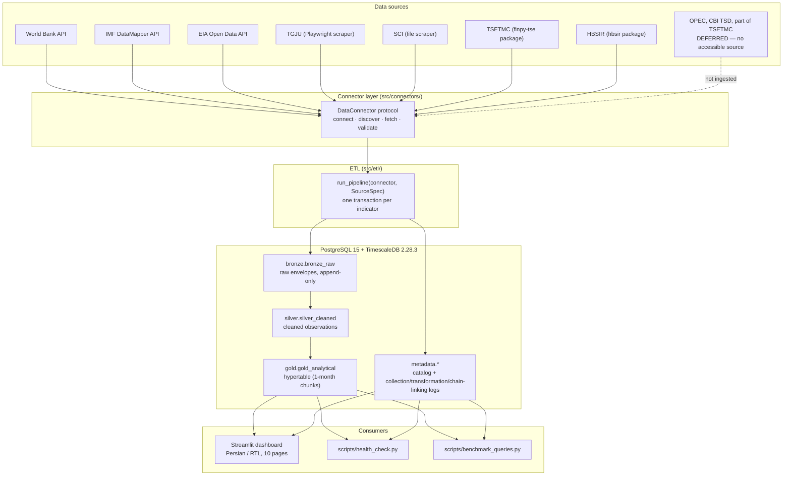

# Architecture and data flow

**Status:** describes **observed** behaviour of the tree as of Phase 8
(2026-09-22). Where a source is deferred, it is shown as absent, not planned.

This is the single top-level map of the platform. The per-phase records it links
are the detailed evidence and are not duplicated here:

- Phase 1 — [VALIDATION.md](phase-1/VALIDATION.md) (foundation)
- Phase 2 — [data_dictionary.md](phase-2/data_dictionary.md) (World Bank indicators + observed coverage)
- Phase 3 — [README.md](phase-3/README.md) (TGJU scraper)
- Phase 4 — [VALIDATION.md](phase-4/VALIDATION.md) (IMF/EIA + the OPEC gate record)
- Phase 5 — [VALIDATION.md](phase-5/VALIDATION.md) (SCI + the CBI gate record)
- Phase 6 — [VALIDATION.md](phase-6/VALIDATION.md) (TSETMC/HBSIR + scope narrowing)
- Phase 7.1 / 7.2 — [README.md](phase-7.1/README.md), [design-system.md](phase-7.2/design-system.md)
- Phase 8 operations — [runbook.md](operations/runbook.md), [troubleshooting.md](operations/troubleshooting.md), [ci.md](operations/ci.md)

---

## 1. The shape of the system

A connector fetches one source; a pipeline writes it through three storage layers
and an audit metadata layer; Airflow schedules the pipelines; the dashboard and
the operational scripts read the result.



The same flow as plain text:

```text
source ──fetch──▶ Connector ──envelope──▶ Bronze ──clean──▶ Silver ──publish──▶ Gold
                    │                        │                │                 │
                    └────────────────────────┴────────────────┴─────────────────┘
                                              ▼
                                   metadata (catalog + audit logs)
                                              ▼
                          dashboard · health check · benchmarks
```

---

## 2. The medallion layers

Four PostgreSQL schemas, created by [`scripts/init-db.sql`](../scripts/init-db.sql)
(`CREATE EXTENSION timescaledb` + `CREATE SCHEMA bronze/silver/gold/metadata`).
The SQLAlchemy models are in [`src/database/schema.py`](../src/database/schema.py).

| Schema | Table | Role | Key facts |
|---|---|---|---|
| `bronze` | `bronze_raw` | Raw ingestion, **append-only** | `raw_data` JSONB holds the source envelope; a re-run adds a new envelope, never replaces one. Provenance (`indicator_id`, `rows_returned`, `source_last_updated`, `envelope_convention`) rides in the `metadata` column. |
| `silver` | `silver_cleaned` | Cleaned, validated observations | One row per `(indicator_id, timestamp)` (`uq_silver_indicator_timestamp`); nulls are **skipped, never imputed**; outliers are flagged, not dropped. Timestamps are period-end and UTC. |
| `gold` | `gold_analytical` | Analysis-ready, chain-linked | **TimescaleDB hypertable** partitioned on `timestamp`, one-month chunks, compressed after 6 months (`segmentby = indicator_id`). Composite PK `(id, timestamp)`. Holds level series plus derived series. |
| `metadata` | `indicator_catalog` | The indicator registry | PK `indicator_id`; unit, frequency, domain, source, availability window, base years, `is_active`. |
| `metadata` | `data_collection_log` | Collection audit | One row per collection attempt: `source_name`, `status`, `records_collected`, `error_message`, `collection_timestamp`. |
| `metadata` | `transformation_log` | Per-hop audit | `source_layer` → `target_layer`, `status` (`success`/`partial`/`failed`), `records_*` counters. |
| `metadata` | `chain_linking_log` | Base-year splice audit | `method`, `records_linked`, `overlap_months`, `avg_confidence`, `status`. |

The hypertable and compression policy are created by
[`src/database/connection.py`](../src/database/connection.py) (`create_hypertable`
+ `add_compression_policy`), **not** by a migration — see §6 for the consequence
on a fresh database.

### Bronze envelope conventions (observed, not universal)

Bronze stores whatever the source gives, wrapped so a reader never has to infer
the shape. Each row records its own convention in
`metadata ->> 'envelope_convention'`:

| Source family | `raw_data` shape |
|---|---|
| World Bank (API) | `{meta, rows}` — `rows` is the API payload verbatim, `meta` the pagination/freshness block |
| IMF (API) | `{rows, meta, raw_response}` — `raw_response` is the untouched multi-country payload |
| EIA (API) | `{rows, meta, raw_response}` — `raw_response` is the **list** of raw page payloads |
| TGJU (scraper) | `{rows: [{html, url, scraped_at}]}` — raw HTML |
| SCI (file scraper) | `{rows, meta}` — `meta.raw_file_base64` is the raw workbook |
| TSETMC (package) | `{rows, meta}` — the raw `indexB2` payload the package discards |
| HBSIR (package) | Derived observations + a manifest; **household microdata is never persisted** |

The per-source detail (fields, checksums, limitations) is in
[data_dictionary.md](phase-2/data_dictionary.md).

---

## 3. Connector → pipeline → Gold

- **A connector owns one source.** It implements the `DataConnector` protocol
  (`connect` / `discover` / `fetch` / `validate`, [`src/connectors/base.py`](../src/connectors/base.py)).
  `fetch()` returns a DataFrame and writes nothing; a richer method
  (`fetch_series()`) carries the raw envelope for the pipeline to persist. This
  keeps the connector testable with no database.
- **A `SourceSpec` describes the source to the runner.** Source name/type,
  frequency, derived-series namespace, per-indicator derivation overrides,
  forecast support, and the Bronze-row parser. New API sources add a connector
  plus a `build_spec()` — they do **not** fork the runner.
- **`run_pipeline(connector, spec)`** ([`src/etl/pipeline.py`](../src/etl/pipeline.py))
  runs discover → Bronze → Silver → Gold. **One session (transaction) per
  indicator**, so an indicator lands completely or not at all and one bad
  indicator cannot roll back another's work.
- **Failures are contained, not swallowed.** A failed indicator is logged and
  counted, the run continues, and the process exits non-zero if any indicator
  failed — the contract Airflow and the health check build on.
- **Idempotency.** Silver upserts on `(indicator_id, timestamp)`; Gold deletes
  and reinserts per indicator (the hypertable PK rules out an upsert). Row counts
  are stable across runs but **Gold row ids change** — never persist a Gold `id`.
- **Derived series are namespaced** by source (`WB.`, `IMF.`, `EIA.`, `SCI.`,
  `TSETMC.TEDPIX.`, …) so a derived id can never collide with a source id.
  Derivation is per-source and opt-in: annual sources publish `.YOY`, TSETMC
  publishes `RET1D` / `MA30` / `.ME`, and HBSIR publishes levels only.
- **Forecasts are explicit.** IMF WEO future-dated periods are retained and
  tagged `observation_type` (`actual`/`estimate`/`forecast`) because the source
  sets `supports_forecasts=True`; every other source rejects future dates.

### Connector status and limitations

Per-source type, frequency, status, and the recorded reason for any deferral.
Deferred sources are **not** planned for Phase 8 — they stay visibly deferred.

| Source | Type | Frequency | Status | Note |
|---|---|---|---|---|
| **World Bank** | API | annual | Implemented (Phase 2) | 12 indicators; reference implementation. [data dictionary](phase-2/data_dictionary.md#indicators) |
| **IMF DataMapper** | API | annual | Implemented (Phase 4) | 6 indicators incl. WEO forecasts (project-defined `actual`/`estimate`/`forecast` label). [record](phase-4/VALIDATION.md) |
| **EIA** | API | monthly | Implemented (Phase 4) | 2 indicators; fixture-verified end to end, **live ingestion unverified** (no real `EIA_API_KEY` in this environment). [record](phase-4/VALIDATION.md) |
| **TGJU** | Scraper (Playwright) | daily | Implemented (Phase 3) | 3 indicators; current price only — history accumulates from daily runs. [record](phase-3/README.md) |
| **SCI** | File scraper (Excel) | monthly / quarterly | Implemented (Phase 5) | 18 catalog rows; urban CPI is the only real multi-base splice (1395→1400). [record](phase-5/VALIDATION.md) |
| **TSETMC** | Package (`finpy-tse`) | daily | Implemented (Phase 6), **scope narrowed** | TEDPIX + `RET1D`/`MA30`/`.ME`. Trading value, market P/E and market cap **deferred** — no historical source in the package. [record](phase-6/VALIDATION.md) |
| **HBSIR** | Package (`hbsir`) | annual | Implemented (Phase 6) | 12 welfare series; relative (not official) poverty line; no equivalence scaling. [record](phase-6/VALIDATION.md) |
| **OPEC** | Scraper | daily | **Deferred** (Phase 4) | Cloudflare blocks programmatic access; not worked around. [gate record](phase-4/VALIDATION.md) |
| **CBI TSD** | Scraper | monthly | **Deferred** (Phase 5) | F5 TSPD bot defense blocks programmatic access; not worked around. [gate record](phase-5/VALIDATION.md) |

The catalog currently holds **54 indicators** across these seven implemented
sources (`world_bank` 12, `sci` 18, `hbsir` 12, `imf` 6, `tgju` 3, `eia` 2,
`tsetmc` 1).

---

## 4. Orchestration — the four Airflow DAGs

DAGs live in [`airflow/dags/`](../airflow/dags/). Each is a thin scheduler around
a pipeline entry point: the DAG schedules the work and surfaces failure; it does
not contain ETL logic. All start at `2026-09-01` in `Asia/Tehran` with
`catchup=False`.

| DAG | Schedule (cron) | Meaning | Source |
|---|---|---|---|
| `tgju_daily` | `0 23 * * *` | every day 23:00 Tehran (market close) | TGJU scraper |
| `tsetmc_daily` | `0 23 * * *` | every day 23:00 Tehran | TSETMC package |
| `sci_weekly` | `0 3 * * 5` | Fridays 03:00 Tehran (low-traffic window) | SCI file scraper |
| `tgju_backfill` | `None` | **manual trigger only**; requires `start_date`/`end_date` in `dag_run.conf` | TGJU scraper |

API sources (World Bank, IMF, EIA) and HBSIR are run by hand (their publication
cadence is monthly-to-annual and a scheduler adds no value); see the
[runbook](operations/runbook.md#2-running-a-pipeline-by-hand).

Failure surfacing follows one pattern: a `_on_failure_callback` logs structured
failure context and escalates at exhausted retries, and the task raises so
Airflow marks it failed (e.g. [`tgju_daily.py`](../airflow/dags/tgju_daily.py)).
The health check (§5) is the independent, database-level view of the same
question.

---

## 5. The dashboard read path

The dashboard is Persian/RTL with ten registered pages
([`dashboard/navigation.py`](../dashboard/navigation.py)). Its data path is
strictly read-only:

- **Gold is the only analytical input.** [`dashboard/repository.py`](../dashboard/repository.py)
  reads `gold.gold_analytical` `LEFT JOIN metadata.indicator_catalog`, with a
  second join on `record_metadata ->> 'derived_from'` for parent provenance
  (`load_series`). Nothing is interpolated, forward-filled, resampled or
  normalized; chain-linking values are displayed as stored.
- **Derivedness is read from metadata, never from an id.** A series is "derived"
  because its row metadata says so, not because its id contains a suffix.
- **Freshness and coverage come from the metadata layer.**
  `source_freshness()` reads the latest `data_collection_log` row per source;
  `coverage_summary()` aggregates Gold per indicator; the
  `expected_periods` primitive ([`dashboard/components/quality.py`](../dashboard/components/quality.py))
  turns a catalog frequency into a calendar-aware expectation. The
  [health check](operations/runbook.md#3-checking-health) reuses these exact
  queries and that exact primitive, so the CLI and the UI cannot disagree.
- **No cache beyond a freshness TTL.** `FRESHNESS_CACHE_TTL_SECONDS`
  ([`dashboard/queries.py`](../dashboard/queries.py)) is the only TTL; a pipeline
  run may need an app restart to show (the cache-TTL item remains deferred).

The operational scripts read the same layers: `scripts/health_check.py`
(`data_collection_log` + `coverage_summary`) and `scripts/benchmark_queries.py`
(`EXPLAIN ANALYZE` on the hot read paths). See the
[runbook](operations/runbook.md).

---

## 6. Storage and display timezone policy

- **Storage is UTC and Gregorian, always.** Every `DateTime` column is
  timezone-aware (`timezone=True`) and defaults to `utc_now()`. Period-end
  timestamps (`YYYY-12-31 00:00:00+00` annual, month-end monthly, session
  instant daily) make heterogeneous frequencies sortable against each other.
- **Display is `Asia/Tehran`.** `Asia/Tehran` is applied only when a value is
  rendered or a selected day is interpreted; `tehran_day_bounds` /
  `jalali_day_bounds` are the only bounds constructors
  ([`dashboard/formatting.py`](../dashboard/formatting.py)). Period ends (UTC
  midnight) are stable; daily snapshot sources are not. The grid stays LTR.
- **Jalali is display-only.** Persian dates are converted to Gregorian for
  storage; the original Jalali label is kept in row metadata for auditability
  (e.g. HBSIR's `jalali_year` on Silver).

---

## 7. Databases, versions and the fresh-database gotcha

The local stack and CI run the **same pinned** TimescaleDB image
(`timescale/timescaledb:2.28.3-pg15`, TimescaleDB 2.28.3 / PostgreSQL 15.18,
digest `sha256:6343bdc8…`). Details and the digest-verification procedure are in
[ci.md](operations/ci.md).

**A fresh database is not created by migrations alone.**
`scripts/init-db.sql` creates the extension and the four schemas, but compose
mounts it via `docker-entrypoint-initdb.d`, so it runs **only on a container's
first initialisation**. No migration contains `CREATE SCHEMA`, so on a fresh
container `alembic upgrade head` fails with
`InvalidSchemaName: schema "bronze" does not exist`. Apply the schema statements
(extension + `CREATE SCHEMA bronze/silver/gold/metadata`) **before** migrating —
this is exactly what the CI integration job does. See the
[runbook](operations/runbook.md#6-applying-a-migration).
